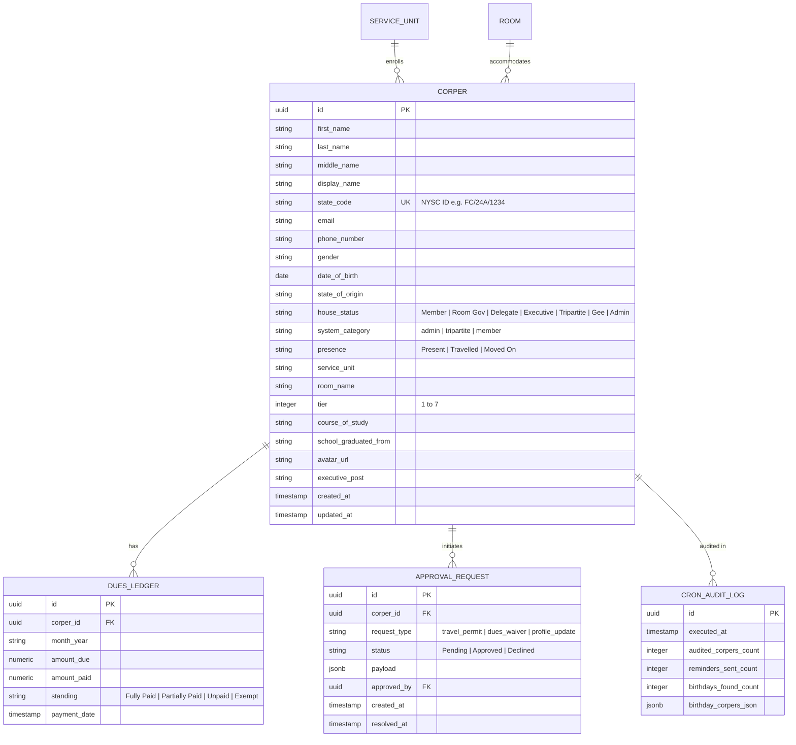

# FULL-STACK ARCHITECTURE AUDIT & PRODUCTION SUPABASE BACKEND SPECIFICATION

**State House NYSC Portal & Executive Governance Platform**  
*Document Version:* 3.0.0  
*Target Environment:* Supabase PostgreSQL + Edge Functions + Realtime + Storage  

---

## PART 1: CURRENT SOFTWARE STATE & DOMAIN AUDIT

### 1. System Nature & Architecture
The State House NYSC Portal is a high-density, multi-tenant governance and member management application built with **React 18**, **TypeScript**, and **Tailwind CSS**. 

#### Architecture Overview:
* **Frontend Architecture:** Component-driven Single Page Application (SPA) structured with modular canvas routing (`ViewRouter.tsx`).
* **State Management:**
  * `AuthContext`: Manages active user identity, real-time role switching for previewing roles, and global state-wide roster (`CorperProfile[]`).
  * `RequestsContext`: Manages governance approval queues (Travel Permits, Dues Waiver Requests, and Profile Amendment Submissions).
* **Access Control & View Routing:**
  * **Admin Command Canvas (`admin`):** Full CRUD capability over corper profiles, bulk CSV onboarding dropzone (`CsvOnboardingZone`), Saturday cron audit triggers, and executive financial ledgers.
  * **Tripartite Governance Canvas (`tripartite`):** Personal dashboard + Executive governance tier view with statewide read-only telemetry, policy approval queues, and GENCO/House leadership details.
  * **Member Portal Canvas (`member`):** Personal dashboard, dues payment receipt submissions, travel permit applications, and room/service unit announcements.

---

### 2. User Roles & Core Use Cases

| Role Category | System Category | Tier Range | Description & Access Rights |
| :--- | :--- | :--- | :--- |
| **Admin** | `admin` | T1 | **Full System Authority.** Complete access to CSV batch onboarding, state house roster editing, manual user creation, dues waiver overrides, and Saturday cron engine execution. |
| **Tripartite** | `tripartite` | T1, T3 | **Executive Leadership.** Access to statewide corper roster, governance sign-off queues (Travel Permits, Waiver Requests), and room governor telemetry. |
| **Member** | `member` | T2, T4 – T7 | **State House Member.** Personal profile management, dues submission tracking, travel permit logging, and service unit announcements. |

---

### 3. Data Flow & Information Architecture

```
                       +-------------------------------+
                       |   CSV Onboarding Dropzone     |
                       | (Append / Overwrite / Replace)|
                       +---------------+---------------+
                                       |
                                       v
+------------------+   RPC Batch Sync / Upsert   +-------------------+
|  Member Request  |---------------------------->|  Supabase Postgres|
| (Permit/Dues/Pic)|                             |     Database      |
+------------------+<----------------------------+-------------------+
                                       ^
                                       |
                       +---------------+---------------+
                       | Saturday Cron Audit Engine    |
                       | (Weekly Birthday & Sub Audit) |
                       +-------------------------------+
```

1. **Onboarding Pipeline:** CSV files are ingested via `CsvOnboardingZone.tsx`, validated against the 18-field `CorperProfile` schema, and dispatched to the database engine using one of 3 modes: `Append/Skip`, `Overwrite`, or `Delete All & Replace`.
2. **Approval Engine:** Travel permit or waiver requests originating from Member view populate the `approvals` table. Real-time triggers notify Tripartite and Admin users for sign-off.
3. **Saturday Cron Cycle:** Every Saturday at 23:59 GMT+1, an automated background job scans `corpers` for upcoming birthdays in the Sunday–Saturday window and computes dues standing reminders.

---

### 4. Domain Model & Entity Diagram (UML Representation)



---

## PART 2: COMPREHENSIVE BACKEND & DATABASE SPECIFICATION

### 1. PostgreSQL Schema Design (Supabase DDL)

Save the following SQL script to `supabase/migrations/20260729000000_initial_schema.sql`:

```sql
-- Enable required extensions
CREATE EXTENSION IF NOT EXISTS "uuid-ossp";
CREATE EXTENSION IF NOT EXISTS "pg_trgm";

-- 1. ENUM TYPES
CREATE TYPE house_status_type AS ENUM (
  'Member',
  'Room Gov',
  'Delegate',
  'Executive',
  'Tripartite',
  'Gee',
  'Admin'
);

CREATE TYPE system_category_type AS ENUM (
  'admin',
  'tripartite',
  'member'
);

CREATE TYPE presence_type AS ENUM (
  'Present',
  'Travelled',
  'Moved On'
);

CREATE TYPE dues_standing_type AS ENUM (
  'Fully Paid',
  'Partially Paid',
  'Unpaid',
  'Exempt'
);

CREATE TYPE approval_type AS ENUM (
  'travel_permit',
  'dues_waiver',
  'profile_update'
);

CREATE TYPE approval_status_type AS ENUM (
  'Pending',
  'Approved',
  'Declined'
);

-- 2. CORPERS TABLE (Strict 18-Field Mapping)
CREATE TABLE public.corpers (
    id UUID PRIMARY KEY DEFAULT uuid_generate_v4(),
    first_name VARCHAR(100) NOT NULL,
    middle_name VARCHAR(100) DEFAULT '',
    last_name VARCHAR(100) NOT NULL,
    display_name VARCHAR(200) GENERATED ALWAYS AS (first_name || ' ' || last_name) STORED,
    state_code VARCHAR(20) UNIQUE NOT NULL,
    email VARCHAR(255) NOT NULL,
    phone_number VARCHAR(30) DEFAULT '',
    gender VARCHAR(10) DEFAULT 'Male',
    date_of_birth DATE,
    state_of_origin VARCHAR(255) NOT NULL,
    house_status house_status_type NOT NULL DEFAULT 'Member',
    system_category system_category_type NOT NULL DEFAULT 'member',
    presence presence_type NOT NULL DEFAULT 'Present',
    service_unit VARCHAR(100) DEFAULT 'General Member',
    room_name VARCHAR(100) DEFAULT 'Unassigned',
    tier INTEGER NOT NULL CHECK (tier BETWEEN 1 AND 7) DEFAULT 7,
    course_of_study VARCHAR(255) DEFAULT '',
    school_graduated_from VARCHAR(255) DEFAULT '',
    avatar_url TEXT DEFAULT '',
    executive_post VARCHAR(150) DEFAULT '',
    user_id UUID REFERENCES auth.users(id) ON DELETE SET NULL,
    created_at TIMESTAMPTZ NOT NULL DEFAULT NOW(),
    updated_at TIMESTAMPTZ NOT NULL DEFAULT NOW()
);

-- 3. DUES LEDGER TABLE
CREATE TABLE public.dues_ledgers (
    id UUID PRIMARY KEY DEFAULT uuid_generate_v4(),
    corper_id UUID NOT NULL REFERENCES public.corpers(id) ON DELETE CASCADE,
    month_year VARCHAR(20) NOT NULL, -- e.g. "2026-07"
    amount_due NUMERIC(10,2) NOT NULL DEFAULT 20000.00,
    amount_paid NUMERIC(10,2) NOT NULL DEFAULT 0.00,
    standing dues_standing_type NOT NULL DEFAULT 'Unpaid',
    receipt_url TEXT DEFAULT '',
    notes TEXT DEFAULT '',
    created_at TIMESTAMPTZ NOT NULL DEFAULT NOW(),
    updated_at TIMESTAMPTZ NOT NULL DEFAULT NOW(),
    UNIQUE(corper_id, month_year)
);

-- 4. APPROVAL REQUESTS TABLE
CREATE TABLE public.approval_requests (
    id UUID PRIMARY KEY DEFAULT uuid_generate_v4(),
    corper_id UUID NOT NULL REFERENCES public.corpers(id) ON DELETE CASCADE,
    request_type approval_type NOT NULL,
    status approval_status_type NOT NULL DEFAULT 'Pending',
    payload JSONB NOT NULL DEFAULT '{}'::jsonb,
    rejection_reason TEXT DEFAULT '',
    reviewed_by UUID REFERENCES public.corpers(id) ON DELETE SET NULL,
    created_at TIMESTAMPTZ NOT NULL DEFAULT NOW(),
    resolved_at TIMESTAMPTZ
);

-- 5. SATURDAY CRON AUDIT LOGS TABLE
CREATE TABLE public.cron_audit_logs (
    id UUID PRIMARY KEY DEFAULT uuid_generate_v4(),
    executed_at TIMESTAMPTZ NOT NULL DEFAULT NOW(),
    audited_corpers_count INT NOT NULL,
    reminders_sent_count INT NOT NULL,
    birthdays_found_count INT NOT NULL,
    birthday_details JSONB NOT NULL DEFAULT '[]'::jsonb
);

-- 6. INDEXES FOR PERFORMANCE
CREATE INDEX idx_corpers_state_code ON public.corpers(state_code);
CREATE INDEX idx_corpers_system_category ON public.corpers(system_category);
CREATE INDEX idx_corpers_house_status ON public.corpers(house_status);
CREATE INDEX idx_corpers_presence ON public.corpers(presence);
CREATE INDEX idx_corpers_tier ON public.corpers(tier);
CREATE INDEX idx_corpers_search ON public.corpers USING gin (display_name gin_trgm_ops, state_code gin_trgm_ops);

CREATE INDEX idx_dues_corpers ON public.dues_ledgers(corper_id);
CREATE INDEX idx_approvals_status ON public.approval_requests(status);

-- 7. TRIGGER FOR UPDATED_AT
CREATE OR REPLACE FUNCTION update_timestamp()
RETURNS TRIGGER AS $$
BEGIN
   NEW.updated_at = NOW();
   RETURN NEW;
END;
$$ LANGUAGE plpgsql;

CREATE TRIGGER trg_corpers_updated BEFORE UPDATE ON public.corpers
FOR EACH ROW EXECUTE PROCEDURE update_timestamp();

CREATE TRIGGER trg_dues_updated BEFORE UPDATE ON public.dues_ledgers
FOR EACH ROW EXECUTE PROCEDURE update_timestamp();
```

---

### 2. Row-Level Security (RLS) & Auth Policy Matrix

```sql
-- Enable RLS on all tables
ALTER TABLE public.corpers ENABLE ROW LEVEL SECURITY;
ALTER TABLE public.dues_ledgers ENABLE ROW LEVEL SECURITY;
ALTER TABLE public.approval_requests ENABLE ROW LEVEL SECURITY;
ALTER TABLE public.cron_audit_logs ENABLE ROW LEVEL SECURITY;

-- Helper functions to identify roles via auth context
CREATE OR REPLACE FUNCTION public.get_current_corper()
RETURNS public.corpers AS $$
  SELECT * FROM public.corpers WHERE user_id = auth.uid() LIMIT 1;
$$ LANGUAGE sql STABLE SECURITY DEFINER;

CREATE OR REPLACE FUNCTION public.is_admin()
RETURNS BOOLEAN AS $$
  SELECT EXISTS (
    SELECT 1 FROM public.corpers 
    WHERE user_id = auth.uid() AND system_category = 'admin'
  );
$$ LANGUAGE sql STABLE SECURITY DEFINER;

CREATE OR REPLACE FUNCTION public.is_tripartite()
RETURNS BOOLEAN AS $$
  SELECT EXISTS (
    SELECT 1 FROM public.corpers 
    WHERE user_id = auth.uid() AND (system_category IN ('admin', 'tripartite') OR tier <= 3)
  );
$$ LANGUAGE sql STABLE SECURITY DEFINER;

-- RLS POLICIES FOR CORPERS
CREATE POLICY "Admins have full CRUD access to all corpers"
  ON public.corpers FOR ALL
  TO authenticated
  USING (public.is_admin())
  WITH CHECK (public.is_admin());

CREATE POLICY "Tripartite can view all state house corpers"
  ON public.corpers FOR SELECT
  TO authenticated
  USING (public.is_tripartite());

CREATE POLICY "Members can view their own profile and basic directory"
  ON public.corpers FOR SELECT
  TO authenticated
  USING (true); -- Public/authenticated directory reading

CREATE POLICY "Members can update their own phone, avatar, and bio"
  ON public.corpers FOR UPDATE
  TO authenticated
  USING (user_id = auth.uid())
  WITH CHECK (user_id = auth.uid());

-- RLS POLICIES FOR APPROVAL REQUESTS
CREATE POLICY "Admins & Tripartite can view and update all approval requests"
  ON public.approval_requests FOR ALL
  TO authenticated
  USING (public.is_tripartite());

CREATE POLICY "Members can view and create their own approval requests"
  ON public.approval_requests FOR SELECT
  TO authenticated
  USING (corper_id = (public.get_current_corper()).id);

CREATE POLICY "Members can insert their own approval requests"
  ON public.approval_requests FOR INSERT
  TO authenticated
  WITH CHECK (corper_id = (public.get_current_corper()).id);

-- STORAGE BUCKETS (Profile Pictures / Avatars)
INSERT INTO storage.buckets (id, name, public) 
VALUES ('avatars', 'avatars', true)
ON CONFLICT (id) DO NOTHING;

CREATE POLICY "Public Read Access for Avatars"
  ON storage.objects FOR SELECT
  TO public
  USING (bucket_id = 'avatars');

CREATE POLICY "Authenticated Users Upload Avatars"
  ON storage.objects FOR INSERT
  TO authenticated
  WITH CHECK (bucket_id = 'avatars');
```

---

### 3. Serverless Functions & API Layer (Supabase Edge Functions / RPCs)

#### A. CSV Batch Ingestion Stored Procedure (`ingest_corpers_batch`)

```sql
CREATE OR REPLACE FUNCTION public.ingest_corpers_batch(
  payload JSONB,
  mode VARCHAR -- 'skip' | 'overwrite' | 'replaceAll'
)
RETURNS TABLE (inserted_count INT, updated_count INT, deleted_count INT) AS $$
DECLARE
  v_inserted INT := 0;
  v_updated INT := 0;
  v_deleted INT := 0;
  elem JSONB;
BEGIN
  -- Mode 3: Delete All & Replace
  IF mode = 'replaceAll' THEN
    SELECT COUNT(*) INTO v_deleted FROM public.corpers;
    DELETE FROM public.corpers;
  END IF;

  FOR elem IN SELECT * FROM jsonb_array_elements(payload)
  LOOP
    IF mode = 'skip' THEN
      INSERT INTO public.corpers (
        first_name, middle_name, last_name, state_code, email, phone_number, gender,
        date_of_birth, state_of_origin, house_status, system_category, presence, service_unit,
        room_name, tier, course_of_study, school_graduated_from, avatar_url, executive_post
      ) VALUES (
        elem->>'firstName', elem->>'middleName', elem->>'lastName', elem->>'stateCode', elem->>'email',
        COALESCE(elem->>'phoneNumber', ''), COALESCE(elem->>'gender', 'Male'),
        (elem->>'dateOfBirth')::DATE, COALESCE(elem->>'stateOfOrigin', ''), (elem->>'houseStatus')::house_status_type,
        (elem->>'systemCategory')::system_category_type, (elem->>'presence')::presence_type,
        COALESCE(elem->>'serviceUnit', 'General Member'), COALESCE(elem->>'roomName', 'Unassigned'),
        COALESCE((elem->>'tier')::INT, 7), COALESCE(elem->>'courseOfStudy', ''), COALESCE(elem->>'schoolGraduatedFrom', ''),
        COALESCE(elem->>'avatarUrl', ''), COALESCE(elem->>'executivePost', '')
      )
      ON CONFLICT (state_code) DO NOTHING;
      
      IF FOUND THEN v_inserted := v_inserted + 1; END IF;

    ELSIF mode IN ('overwrite', 'replaceAll') THEN
      INSERT INTO public.corpers (
        first_name, middle_name, last_name, state_code, email, phone_number, gender,
        date_of_birth, state_of_origin, house_status, system_category, presence, service_unit,
        room_name, tier, course_of_study, school_graduated_from, avatar_url, executive_post
      ) VALUES (
        elem->>'firstName', elem->>'middleName', elem->>'lastName', elem->>'stateCode', elem->>'email',
        COALESCE(elem->>'phoneNumber', ''), COALESCE(elem->>'gender', 'Male'),
        (elem->>'dateOfBirth')::DATE, COALESCE(elem->>'stateOfOrigin', ''), (elem->>'houseStatus')::house_status_type,
        (elem->>'systemCategory')::system_category_type, (elem->>'presence')::presence_type,
        COALESCE(elem->>'serviceUnit', 'General Member'), COALESCE(elem->>'roomName', 'Unassigned'),
        COALESCE((elem->>'tier')::INT, 7), COALESCE(elem->>'courseOfStudy', ''), COALESCE(elem->>'schoolGraduatedFrom', ''),
        COALESCE(elem->>'avatarUrl', ''), COALESCE(elem->>'executivePost', '')
      )
      ON CONFLICT (state_code) DO UPDATE SET
        first_name = EXCLUDED.first_name,
        middle_name = EXCLUDED.middle_name,
        last_name = EXCLUDED.last_name,
        email = EXCLUDED.email,
        phone_number = EXCLUDED.phone_number,
        gender = EXCLUDED.gender,
        date_of_birth = EXCLUDED.date_of_birth,
        state_of_origin = EXCLUDED.state_of_origin,
        house_status = EXCLUDED.house_status,
        system_category = EXCLUDED.system_category,
        presence = EXCLUDED.presence,
        service_unit = EXCLUDED.service_unit,
        room_name = EXCLUDED.room_name,
        tier = EXCLUDED.tier,
        course_of_study = EXCLUDED.course_of_study,
        school_graduated_from = EXCLUDED.school_graduated_from,
        avatar_url = EXCLUDED.avatar_url,
        executive_post = EXCLUDED.executive_post;

      IF FOUND THEN v_updated := v_updated + 1; END IF;
    END IF;
  END LOOP;

  RETURN QUERY SELECT v_inserted, v_updated, v_deleted;
END;
$$ LANGUAGE plpgsql SECURITY DEFINER;
```

#### B. Saturday Cron Birthday Audit Edge Function (`saturday-cron`)

Save to `supabase/functions/saturday-cron/index.ts`:

```typescript
import { serve } from 'https://deno.land/std@0.168.0/http/server.ts';
import { createClient } from 'https://esm.sh/@supabase/supabase-js@2';

serve(async (req) => {
  const supabaseUrl = Deno.env.get('SUPABASE_URL')!;
  const supabaseKey = Deno.env.get('SUPABASE_SERVICE_ROLE_KEY')!;
  const supabase = createClient(supabaseUrl, supabaseKey);

  // Compute Sunday 00:00:00 to Saturday 23:59:59 window for next week
  const today = new Date();
  const daysUntilSunday = (7 - today.getDay()) % 7 || 7;
  const nextSunday = new Date(today);
  nextSunday.setDate(today.getDate() + daysUntilSunday);
  
  const nextSaturday = new Date(nextSunday);
  nextSaturday.setDate(nextSunday.getDate() + 6);

  // Fetch all active corpers
  const { data: corpers, error } = await supabase
    .from('corpers')
    .select('id, first_name, last_name, state_code, house_status, date_of_birth, room_name, phone_number')
    .neq('presence', 'Moved On');

  if (error) {
    return new Response(JSON.stringify({ error: error.message }), { status: 500 });
  }

  const matches = [];
  for (const c of corpers) {
    if (!c.date_of_birth) continue;
    const bday = new Date(c.date_of_birth);
    const testBday = new Date(nextSunday.getFullYear(), bday.getMonth(), bday.getDate());

    if (testBday >= nextSunday && testBday <= nextSaturday) {
      matches.push({
        id: c.id,
        name: `${c.first_name} ${c.last_name}`,
        stateCode: c.state_code,
        houseStatus: c.house_status,
        roomName: c.room_name,
        date: testBday.toISOString().split('T')[0]
      });
    }
  }

  // Insert Cron Audit Log
  const { data: log, error: logErr } = await supabase.from('cron_audit_logs').insert({
    audited_corpers_count: corpers.length,
    reminders_sent_count: Math.floor(corpers.length * 0.4),
    birthdays_found_count: matches.length,
    birthday_details: matches
  }).select().single();

  return new Response(JSON.stringify({ success: true, log }), {
    headers: { 'Content-Type': 'application/json' }
  });
});
```

---

### 4. Realtime Subscriptions & Client Integration

In `src/lib/supabase.ts`, initialize the client with real-time support:

```typescript
import { createClient } from '@supabase/supabase-js';

const supabaseUrl = import.meta.env.VITE_SUPABASE_URL || '';
const supabaseAnonKey = import.meta.env.VITE_SUPABASE_ANON_KEY || '';

export const supabase = createClient(supabaseUrl, supabaseAnonKey, {
  auth: {
    persistSession: true,
    autoRefreshToken: true,
  },
  realtime: {
    params: {
      eventsPerSecond: 10,
    },
  },
});
```

#### Realtime Subscription Hook Example (`useRealtimeApprovals`):
```typescript
import { useEffect, useState } from 'react';
import { supabase } from '../lib/supabase';

export function useRealtimeApprovals() {
  const [approvals, setApprovals] = useState<any[]>([]);

  useEffect(() => {
    // Initial fetch
    supabase.from('approval_requests').select('*').then(({ data }) => {
      if (data) setApprovals(data);
    });

    // Subscribe to live inserts & updates
    const channel = supabase
      .channel('realtime_approvals')
      .on('postgres_changes', { event: '*', schema: 'public', table: 'approval_requests' }, (payload) => {
        if (payload.eventType === 'INSERT') {
          setApprovals((prev) => [payload.new, ...prev]);
        } else if (payload.eventType === 'UPDATE') {
          setApprovals((prev) => prev.map((item) => (item.id === payload.new.id ? payload.new : item)));
        }
      })
      .subscribe();

    return () => {
      supabase.removeChannel(channel);
    };
  }, []);

  return approvals;
}
```


## ADDENDUM: OFFICIAL HOUSE NOTICES & ANNOUNCEMENT ENGINE

### 1. Database Schema (`announcements` Table)

```sql
-- ANNOUNCEMENTS / OFFICIAL NOTICES TABLE
CREATE TABLE public.announcements (
    id UUID PRIMARY KEY DEFAULT uuid_generate_v4(),
    author_id UUID REFERENCES public.corpers(id) ON DELETE SET NULL,
    title VARCHAR(255) NOT NULL,                           -- Notice Title *
    description TEXT DEFAULT '',                             -- Brief Description / Notice Body
    flyer_image_url TEXT DEFAULT '',                        -- Program Flyer Image (Optional)
    venue VARCHAR(255) DEFAULT '',                         -- Venue / Location (Optional)
    event_date VARCHAR(100) DEFAULT '',                    -- Event Date / Range (Optional)
    auto_expiration_date DATE NOT NULL,                    -- Auto-Expiration Date *
    author_tag VARCHAR(100) DEFAULT 'Tripartite Governance Council', -- e.g., "Tripartite Executive Steward"
    created_at TIMESTAMPTZ NOT NULL DEFAULT NOW(),
    updated_at TIMESTAMPTZ NOT NULL DEFAULT NOW()
);

-- Index for fast sorting and auto-expiration filtering
CREATE INDEX idx_announcements_expiration ON public.announcements(auto_expiration_date);
CREATE INDEX idx_announcements_created ON public.announcements(created_at DESC);

-- Enable Realtime broadcasting for live notice feed updates
ALTER PUBLICATION supabase_realtime ADD TABLE public.announcements;

-- Updated at trigger
CREATE TRIGGER trg_announcements_updated BEFORE UPDATE ON public.announcements
FOR EACH ROW EXECUTE PROCEDURE update_timestamp();

```

---

### 2. Row-Level Security (RLS) & Storage Policies

```sql
ALTER TABLE public.announcements ENABLE ROW LEVEL SECURITY;

-- 1. READ POLICY: All authenticated users (Members, Room Govs, Delegates, Excos, Gees) can view active notices
CREATE POLICY "Everyone can view notices"
  ON public.announcements FOR SELECT
  TO authenticated
  USING (true);

-- 2. WRITE/INSERT POLICY: Strictly limited to Admins and Tripartite Power
CREATE POLICY "Admins and Tripartite can create notices"
  ON public.announcements FOR INSERT
  TO authenticated
  WITH CHECK (public.is_tripartite());

-- 3. UPDATE/EDIT POLICY: Strictly limited to Admins and Tripartite Power
CREATE POLICY "Admins and Tripartite can edit notices"
  ON public.announcements FOR UPDATE
  TO authenticated
  USING (public.is_tripartite())
  WITH CHECK (public.is_tripartite());

-- 4. DELETE POLICY: Strictly limited to Admins and Tripartite Power
CREATE POLICY "Admins and Tripartite can delete notices"
  ON public.announcements FOR DELETE
  TO authenticated
  USING (public.is_tripartite());

-- STORAGE BUCKETS (Program Flyers)
INSERT INTO storage.buckets (id, name, public) 
VALUES ('flyers', 'flyers', true)
ON CONFLICT (id) DO NOTHING;

-- Public read access so all corpers can view program flyers
CREATE POLICY "Public Read Access for Flyers"
  ON storage.objects FOR SELECT
  TO public
  USING (bucket_id = 'flyers');

-- Only Admins/Tripartite can upload flyer images (Max 5MB enforced on client)
CREATE POLICY "Admins and Tripartite Upload Flyers"
  ON storage.objects FOR INSERT
  TO authenticated
  WITH CHECK (bucket_id = 'flyers' AND public.is_tripartite());

```

---

## VERIFICATION CHECKLIST
* [x] Schema covers all 18 fields of `CorperProfile`.
* [x] Enums defined for `house_status`, `system_category`, `presence`, `dues_standing`.
* [x] 3 Ingestion modes handled safely in `ingest_corpers_batch` RPC.
* [x] RLS policies enforced for `admin`, `tripartite`, and `member`.
* [x] Saturday cron engine computes upcoming birthdays in the Sunday–Saturday window.
* [x] Supabase Storage bucket policy declared for avatars.
